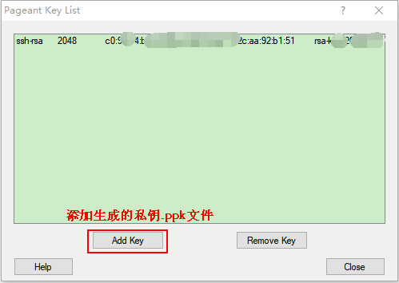

# Git常用命令

> 需要提前下载安装[Git客户端](https://git-scm.com/)  

#### 常用操作

> **注意：git对文件名称大小写不敏感**  

```bash
################## clone ###################
# 克隆项目
git clone <git地址>
# 根据分支克隆
git clone -b <分支名> <git地址>

################### 提交 ####################
# 查看状态
git status

# 提交文件变化到暂存区
# 提交被修改(modified)和被删除(deleted)文件，不包括新文件(new)
git add -u
# 提交新文件(new)和被修改(modified)文件，不包括被删除(deleted)文件
git add .
# 提交所有变化
git add -A

# 提交文件至本地仓库区
git commit –m '<本次提交描述>'
# 以下两条命令相同，合并操作，提交文件变化，提交本地仓库区，等价于 git add . 之后 git commit –m '<本次提交描述>'
git commit –am '<本次提交描述>'
git commit –a –m '<本次提交描述>'

# 将本地版本库的分支推送到远程服务器
# git push <远程服务器> <分支>
git push origin master
# 无特殊配置为提交当前分支
git push

################### 更新 ####################
# 从远程拉取最新内容 
git fetch
# 将拉取下来的最新内容合并到当前分支
git merge

# git pull 等价于上面两步操作
# 但会对代码进行破坏性更新，建议使用 git fetch，git merge 进行代码更新
git pull
```

#### 暂存

> 切换分支时存在未提交的文件，可以使用暂存  

```bash
# 添加暂存
git stash

# 查看暂存记录列表
git stash list

# 应用某个存储，但不会把该存储从列表中删除
# git stash apply
git stash apply stash@{0}

# 应用并删除某个存储
# git stash pop
git stash pop stash@{0}

# 删除某个存储
# git stash drop
git stash drop stash@{0}

# 清空所有暂存的 stash
git stash clear
```

#### 分支

```bash
# 显示所有参数使用方法
git branch -h

# 查看所有分支，参数v显示版本号注释等附加信息，a显示所有
git branch -va
# * 开头的为当前本地分支，origin为远程分支
#   gh-pages                5c3cbe8 Create CNAME
# * master                  20575cc shouye
#   remotes/origin/HEAD     -> origin/master
#   remotes/origin/gh-pages 5c3cbe8 Create CNAME
#   remotes/origin/master   20575cc shouye
#   remotes/origin/test     20575cc shouye

# 创建分支
git branch <分支名>
# 提交分支到远程服务器
git push origin <分支名>

# 删除本地分支
git branch -d <分支名>
# 删除远程服务器分支
git push origin -d <分支名>

# 切换分支
git checkout <分支名>

# 创建并切换分支
git checkout -b <分支名>

# 拉取远程分支（首次拉取），本地没有
git fetch origin <分支名>
git checkout <分支名>
```

#### git 回退版本

```bash
# 查看提交记录
git log
#commit <commit id 1> (HEAD -> master, origin/master)
#Author: <用户名> <邮箱>
#Date:   <时间>
#
#    <commit message 1>
#
#commit <commit id 2>
#Author: <用户名> <邮箱>
#Date:   <时间>
#
#    <commit message 2>

# 增加--pretty=oneline参数只显示commit id和commit message
git log --pretty=oneline
# <commit id 1> (HEAD -> master, origin/master) <commit message 1>
# <commit id 2> <commit message 2>

# 回退到指定commit id，这一步最好在当前代码 commit 之后操作，commit之后源代码可找回
# --soft 回退到某个版本
# --hard 撤销工作区中所有未提交的修改内容，将暂存区与工作区都回到上一次版本，并删除之前的所有信息提交
git reset --soft <commit id>
# HEAD is now at xxxxxx commit

# 强制提交
git push origin <分支名> --force
```

#### git 恢复工作区文件

```bash
# 查看更改的文件
git status

# 如果add到暂存区需要reset，重置暂存区最近一次提交
# 如果已经commit，需要将文件回退到commit前
git reset HEAD <文件名>

# 恢复工作区文件
git checkout <文件名>
```

#### git 忽略文件（本地）

```bash
# git项目根目录，编辑.git/info/exclude，添加需要忽略的文件
vim .git/info/exclude

# 如果已经包含未暂存的更改，需要运行
git update-index --skip-worktree [<file>...]

# 恢复更改跟踪，取消.git/info/exclude中的配置后，需要运行
git update-index --no-skip-worktree [<file>...]
```

#### 提交gh-pages分支以供展示

```bash
# dist为打包后的文件目录
git subtree push --prefix dist origin gh-pages
```

#### git log 图形化

```bash
git log --graph --pretty="(%p) %h %s"
```

#### 统计贡献者代码行数

```bash
# --author="" 为贡献者，$(git config --get user.email)表示当前用户账号
git log --author="$(git config --get user.email)" --pretty=tformat: --numstat | gawk '{ add += $1; subs += $2; loc += $1 - $2 } END { printf "增加的行数:%s 删除的行数:%s 总行数: %s\n", add, subs, loc }'
```

#### 使用配置

```bash
# 1、配置用户名
# 全局
git config --global user.name '<用户名>'
# 非全局，在项目根目录（.git文件夹所在的目录）
git config user.name '<用户名>'

# 2、配置邮箱
# 全局
git config --global user.email '<登录邮箱>'
# 非全局，在项目根目录（.git文件夹所在的目录）
git config user.email '<登录邮箱>'

# 3、生成密钥，与 步骤2 中邮箱相同
ssh-keygen -t rsa -C '<登录邮箱>'
  # (1) Enter file in which to save the key 第一次是密钥地址，输入直接回车
  # (2) Enter passphrase 第二次输入是密码
  # (3) Enter same passphrase again 第三次输入是确认密码

# 4、将生成的SSH公钥添加到GitLab或者GitHub或者码云等平台中
  # (1) 登录之后在 用户设置页面 -> SSH密钥
  # (2) 将 id_rsa.pub 中的公钥内容全部复制到 Key 文本域输入框（使用PuTTYgen生成私钥也添加到此处，PuTTYgen使用下面有介绍）
  # (3) 标题会自动生成也可以自行修改，添加密钥

# 5、开始使用
```

> **Git客户端工具[Sourcetree](https://www.sourcetreeapp.com/)**  
> ```C:\Users\<用户名>\AppData\Local\Atlassian\SourceTree```目录下创建```accounts.json```，内容如下  

```json
[
  {
    "$id": "1",
    "$type": "SourceTree.Api.Host.Identity.Model.IdentityAccount, SourceTree.Api.Host.Identity",
    "Authenticate": true,
    "HostInstance": {
      "$id": "2",
      "$type": "SourceTree.Host.Atlassianaccount.AtlassianAccountInstance, SourceTree.Host.AtlassianAccount",
      "Host": {
        "$id": "3",
        "$type": "SourceTree.Host.Atlassianaccount.AtlassianAccountHost, SourceTree.Host.AtlassianAccount",
        "Id": "atlassian account"
      },
      "BaseUrl": "https://id.atlassian.com/"
    },
    "Credentials": {
      "$id": "4",
      "$type": "SourceTree.Model.BasicAuthCredentials, SourceTree.Api.Account",
      "Username": "",
      "Email": null
    },
    "IsDefault": false
  }
]
```

> ```C:\Users\<用户名>\AppData\Local\Atlassian\SourceTree.exe_Url_*****\x.x.x.x\user.config```，在```</SourceTree.Properties.Settings>```节点前添加以下内容  

```xml
<setting name="AgreedToEULA" serializeAs="String">
    <value>True</value>
</setting>
<setting name="AgreedToEULAVersion" serializeAs="String">
    <value>20160201</value>
</setting>
```

> **Git客户端工具[TortoiseGit](https://tortoisegit.org/)**  

> 使用PuTTYgen生成密钥  


> 配置使用私钥使用，私钥文件为.ppk文件  




#### Github速度慢优化方法

> 获取github域名最快访问ip，[https://github.com.ipaddress.com/](https://github.com.ipaddress.com/) 添加到hosts文件  
> [github.com](https://www.ipaddress.com/site/github.com)  
> [global-ssl.fastly.net](https://www.ipaddress.com/site/global-ssl.fastly.net)  
> [github.global.ssl.fastly.net](https://www.ipaddress.com/site/github.global.ssl.fastly.net)  

```bash
<获取的IP> github.com
<获取的IP> global-ssl.fastly.Net
<获取的IP> github.global.ssl.fastly.net
```

> Linux、Mac下修改```/etc/hosts```文件，修改完后执行  

```bash
# 在命令行中输入以下命令使hosts生效 -> Linux（可能需要安装 nscd）
nscd -i hosts

# 在命令行中输入以下命令使hosts生效 -> Mac（>=10.10.4）
sudo killall -HUP mDNSResponder
```

> Windows下修改 ```c:\Windows\System32\drivers\etc\hosts```文件，修改完后执行  

```bash
# 在命令行中输入以下命令使hosts生效
ipconfig /flushdns
```
