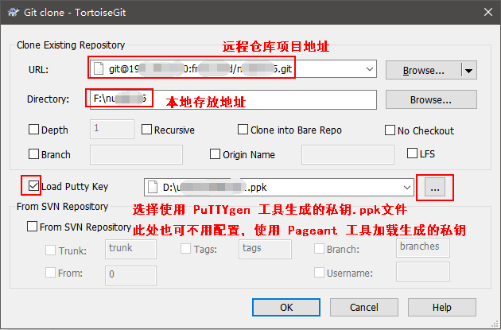

# Git常用命令

> 需要提前下载安装[Git客户端](https://git-scm.com/)  

#### 使用配置

```bash
# 1、全局配置用户名
git config --global user.name '<用户名>'

# 2、全局配置邮箱
git config --global user.email '<登录邮箱>'

# 3、生成密钥，与 步骤2 中邮箱相同
ssh-keygen -t rsa -C '<登录邮箱>'
  # (1) Enter file in which to save the key 第一次是密钥地址，输入直接回车
  # (2) Enter passphrase 第二次输入是密码
  # (3) Enter same passphrase again 第三次输入是确认密码

# 4、将生成的SSH公钥添加到GitLab或者GitHub或者码云等平台中
  # (1) 登录之后在 用户设置页面 -> SSH密钥
  # (2) 将 id_rsa.pub 中的公钥内容全部复制到 Key 文本域输入框（使用PuTTYgen生成私钥也添加到此处，PuTTYgen使用下面有介绍）
  # (3) 标题会自动生成也可以自行修改，添加密钥

# 5、开始使用
```

> **Git客户端工具[Sourcetree](https://www.sourcetreeapp.com/)**  
> ```C:\Users\<用户名>\AppData\Local\Atlassian\SourceTree```目录下创建```accounts.json```，内容如下  

```json
[
  {
    "$id": "1",
    "$type": "SourceTree.Api.Host.Identity.Model.IdentityAccount, SourceTree.Api.Host.Identity",
    "Authenticate": true,
    "HostInstance": {
      "$id": "2",
      "$type": "SourceTree.Host.Atlassianaccount.AtlassianAccountInstance, SourceTree.Host.AtlassianAccount",
      "Host": {
        "$id": "3",
        "$type": "SourceTree.Host.Atlassianaccount.AtlassianAccountHost, SourceTree.Host.AtlassianAccount",
        "Id": "atlassian account"
      },
      "BaseUrl": "https://id.atlassian.com/"
    },
    "Credentials": {
      "$id": "4",
      "$type": "SourceTree.Model.BasicAuthCredentials, SourceTree.Api.Account",
      "Username": "",
      "Email": null
    },
    "IsDefault": false
  }
]
```

> ```C:\Users\<用户名>\AppData\Local\Atlassian\SourceTree.exe_Url_*****\x.x.x.x\user.config```，在```</SourceTree.Properties.Settings>```节点前添加以下内容  

```xml
<setting name="AgreedToEULA" serializeAs="String">
    <value>True</value>
</setting>
<setting name="AgreedToEULAVersion" serializeAs="String">
    <value>20160201</value>
</setting>
```

> **Git客户端工具[TortoiseGit](https://tortoisegit.org/)**  

> 使用PuTTYgen生成密钥  


> 配置使用私钥使用，私钥文件为.ppk文件  




#### 常用操作

> **注意：git对文件名称大小写不敏感**  

```bash
################## clone ###################
# 克隆项目
git clone <git地址>
# 根据分支克隆
git clone -b <分支名> <git地址>

################### 提交 ####################
# 查看状态
git status

# 提交文件变化到暂存区
# 提交被修改(modified)和被删除(deleted)文件，不包括新文件(new)
git add -u
# 提交新文件(new)和被修改(modified)文件，不包括被删除(deleted)文件
git add .
# 提交所有变化
git add -A

# 提交文件至本地仓库区
git commit –m '<本次提交描述>'
# 以下两条命令相同，合并操作，提交文件变化，提交本地仓库区，等价于 git add . 之后 git commit –m '<本次提交描述>'
git commit –am '<本次提交描述>'
git commit –a –m '<本次提交描述>'

# 将本地版本库的分支推送到远程服务器
# git push <远程服务器> <分支>
git push origin master
# 当只关联一个远程，只有一个分支时，可以使用
git push

################### 更新 ####################
# 从远程主机的master分支拉取最新内容 
git fetch origin master
# 将拉取下来的最新内容合并到当前所在的分支中
git merge FETCH_HEAD

# git pull <远程主机名> <远程分支名>:<本地分支名>，等价于上面两步操作
git pull
```

#### Github速度慢优化方法

> 获取github域名最快访问ip，[https://github.com.ipaddress.com/](https://github.com.ipaddress.com/)，修改hosts文件，位置如下  

> Linux下修改```/etc/hosts```文件，修改完后执行  

```bash
# 在命令行中输入以下命令是hosts生效
sudo dscacheutil -flushcache
```

> Windows下修改 ```c:\Windows\System32\drivers\etc\hosts```文件，修改完后执行  

```bash
# 在命令行中输入以下命令是hosts生效
ipconfig /flushdns
```

#### 提交gh-pages分支以供展示

```bash
# _book为打包后的文件目录
git subtree push --prefix _book origin gh-pages
```

#### 分支

```bash
# 显示所有参数使用方法
git branch -h

# 查看所有分支，参数v显示版本号注释等附加信息，a显示所有
git branch -va
# * 开头的为当前本地分支，origin为远程分支
#   gh-pages                5c3cbe8 Create CNAME
# * master                  20575cc shouye
#   remotes/origin/HEAD     -> origin/master
#   remotes/origin/gh-pages 5c3cbe8 Create CNAME
#   remotes/origin/master   20575cc shouye
#   remotes/origin/test     20575cc shouye

# 创建分支
git branch <分支名>
# 提交分支到远程服务器
git push origin <分支名>

# 删除本地分支
git branch -d <分支名>
# 删除远程服务器分支
git push origin -d <分支名>

# 切换分支
git checkout <分支名>

# 创建并切换分支
git checkout -b <分支名>
```

#### git 回退版本

```bash
# 查看提交记录
git log
#commit <commit id 1> (HEAD -> master, origin/master)
#Author: <用户名> <邮箱>
#Date:   <时间>
#
#    <commit message 1>
#
#commit <commit id 2>
#Author: <用户名> <邮箱>
#Date:   <时间>
#
#    <commit message 2>

# 增加--pretty=oneline参数只显示commit id和commit message
git log --pretty=oneline
# <commit id 1> (HEAD -> master, origin/master) <commit message 1>
# <commit id 2> <commit message 2>

# 回退到指定commit id，这一步最好在当前代码 commit 之后操作，commit之后源代码可找回
git reset --hard <commit id>
# HEAD is now at xxxxxx commit

# 已推送到远程仓库的代码回退后，需要强制推送到远程服务器，push时需要加--force
git push origin HEAD --force

# 回退被覆盖掉代码找回，查看操作记录，然后在使用 git reset --hard <commit id> 找回
# 已推送到远程仓库的代码，回退被覆盖掉代码找回后，无需强制推送到远程服务器，push时不用加--force
git reflog
```

#### git 恢复工作区文件

```bash
# 查看更改的文件
git status

# 如果add到暂存区需要reset，重置暂存区最近一次提交
# 如果已经commit，需要将文件回退到commit前
git reset HEAD <文件名>

# 恢复工作区文件
git checkout <文件名>
```

#### git log 状态下如何退出

```bash
# 方法 1
# 英文状态摁 q
q

# 方法 2
# git bash 可能无效
ctrl + c
```

#### 统计贡献者代码行数

```bash
# --author="" 为贡献者用户名，$(git config --get user.name)表示当前用户
git log --author="$(git config --get user.name)" --pretty=tformat: --numstat | awk '{ add += $1; subs += $2; loc += $1 - $2 } END { printf "added lines: %s, removed lines: %s, total lines: %s\n", add, subs, loc }' -
```