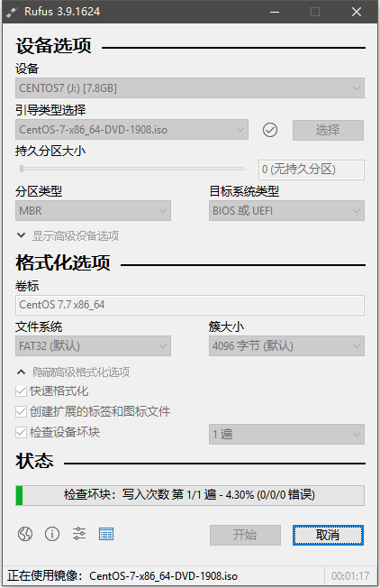
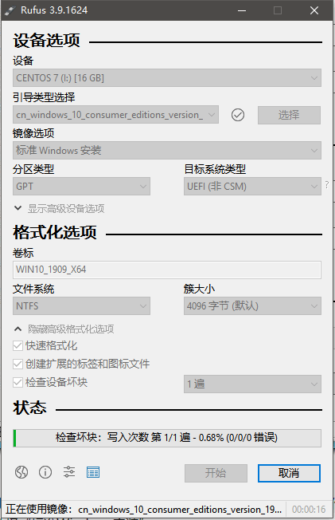
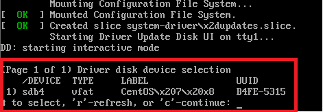

# 

#### iso系统镜像

> CentOS系统镜像下载[请点击](https://www.centos.org/)  
> Windows系统镜像下载[请点击](https://msdn.itellyou.cn/)  

> iso镜像校验  

```bash
# 使用Windows下certutil工具，打开命令提示符使用以下命令
# Windows iso镜像需要SHA1
# CentOS iso镜像需要SHA256
certutil -hashfile <文件路径> MD5
certutil -hashfile <文件路径> SHA1
certutil -hashfile <文件路径> SHA256
```

#### 使用Rufus创建USB安装盘

> Rufus下载地址[请点击](http://rufus.ie/)  

> CentOS USB安装盘示例  



> Windows USB安装盘示例  



#### CentOS安装

> 1、进入CentOS安装界面，按TAB键进入配置编辑（根据提示，uefi是按e键）  
> 2、将配置改为```vmlinuz initrd=initrd.img inst.stage2=hd......quiet```改为```vmlinuz initrd=initrd.img linux dd quiet```  
> 3、修改之后回车系统会进入磁盘设备列表，查看U盘的设备名  
> 4、记住设备名（如下图所示，如：sdb4），然后按```CTRL + ALT + DEL```重启，进入安装界面，按TAB编辑配置，改为```vmlinuz initrd=initrd.img inst.stage2=hd:/dev/sdb4 quiet```  
> 5、sdb4对应U盘的设备名，然后按回车进入图形安装界面  



#### Windows安装

> 注意：DELL ChengMing3980 8代CPU，系统应为：UEFI+GPT+WIN10