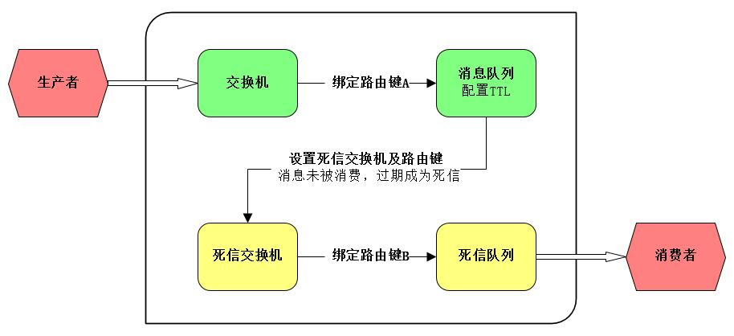

# RabbitMQ

> 依赖  

```xml
<!-- rabbitmq -->
<dependency>
    <groupId>org.springframework.boot</groupId>
    <artifactId>spring-boot-starter-amqp</artifactId>
</dependency>
```

#### 延时队列

> CentOS版本```7.9```，RabbitMQ版本```3.8.19-1.el7```，Erlang版本```23.3.4.5-1.el7```  

```bash
# rabbitmq yml 配置
spring:
  # 连接配置
  rabbitmq:
    host: 127.0.0.1
    port: 5672
    virtual-host: /
    username: <username>
    password: <password>
```

###### 1、TTL + 死信队列



> 1、TTL队列，创建交换机（任意），创建队列并设置```x-dead-letter-exchange```，```x-dead-letter-routing-key```；  
> 2、死信队列，创建交换机（一般为```DirectExchange```），创建队列；  
> 3、注意TTL队列与死信队列之间的Routing key一致；  
> 4、只对死信队列进行监听消费，TTL队列无消费者超时自动投递到死信交换机，达到延时目的。  
> 注意：TTL时间可以在创建TTL队列时统一设置，也可以在发送消息时设置```expiration```，```message.getMessageProperties().setExpiration("5000")```  

```java
import org.springframework.amqp.core.*;
import org.springframework.context.annotation.Bean;
import org.springframework.context.annotation.Configuration;

/**
 * RabbitMQ 配置
 */
@Configuration
public class RabbitMQConfig {
    // TTL交换机名称
    public static final String TTL_EXCHANGE_NAME = "mq.exchange.ttl";
    // TTL队列名称
    public static final String TTL_QUEUE_NAME = "mq.queue.ttl";
    // TTL Routingkey，topic类型
    private final String TTL_ROUTING_KEY = "ttl.#";
    // 死信交换机名称
    private final String DEAD_LETTER_EXCHANGE_NAME = "mq.exchange.dead.letter";
    // 死信队列名称
    public static final String DEAD_LETTER_QUEUE_NAME = "mq.queue.dead.letter";
    // 死信队列Routingkey
    private final String DELAY_TO_DEAD_ROUTING_KEY = "dead.letter";

    // TTL交换机
    @Bean
    public TopicExchange ttlExchange() {
        return ExchangeBuilder.topicExchange(TTL_EXCHANGE_NAME).durable(true).build();
    }
    // TTL队列
    @Bean
    public Queue ttlQueue() {
        Map<String, Object> args = new HashMap<>(2);
        // 死信队列交换机
        args.put("x-dead-letter-exchange", DEAD_LETTER_EXCHANGE_NAME);
        // 死信队列路由key
        args.put("x-dead-letter-routing-key", DELAY_TO_DEAD_ROUTING_KEY);
        return QueueBuilder.durable(TTL_QUEUE_NAME).withArguments(args).build();
    }
    // TTL队列绑定到交换机
    @Bean
    public Binding ttlExchangeBinding() {
        return BindingBuilder.bind(ttlQueue()).to(ttlExchange()).with(TTL_ROUTING_KEY);
    }
    // 死信交换机
    @Bean
    public DirectExchange deadLetterExchange() {
        return new DirectExchange(DEAD_LETTER_EXCHANGE_NAME, true, false, null);
    }
    // 死信队列
    @Bean
    public Queue deadLetterQueue() {
        return new Queue(DEAD_LETTER_QUEUE_NAME, true, false, false, null);
    }
    // 死信队列绑定到交换机
    @Bean
    public Binding deadLetterExchangeBinding() {
        return BindingBuilder.bind(deadLetterQueue()).to(deadLetterExchange()).with(DELAY_TO_DEAD_ROUTING_KEY);
    }
}
```

```java
import org.springframework.amqp.rabbit.annotation.RabbitListener;
import org.springframework.stereotype.Service;

/**
 * RabbitMQ 消息消费者
 */
@Service
public class RabbitMQMessageReceiver {
    // 死信队列监听
    @RabbitListener(queues = RabbitMQConfig.DEAD_LETTER_QUEUE_NAME)
    public void receiveDeadLetterMessage(String message) {
        // 业务处理
    }
}
```

```java
import org.springframework.amqp.rabbit.core.RabbitTemplate;
import org.springframework.beans.factory.annotation.Autowired;
import org.springframework.stereotype.Service;

/**
 * RabbitMQ 消息生产者
 */
@Service
public class RabbitMQMessageSender {

    @Autowired
    private RabbitTemplate rabbitTemplate;

    public void businessMethod() {
        String routingKey = "ttl.test";
        String msg = "message：ttl.test";
        rabbitTemplate.convertAndSend(RabbitMQConfig.TTL_EXCHANGE_NAME, routingKey, msg, message -> {
            // TTL + 死信队列：通过setExpiration方法设置expiration
            message.getMessageProperties().setExpiration("5000");
            return message;
        });
    }
}
```

###### 2、延时队列

> 1、安装并启用rabbitmq_delayed_message_exchange插件，[请查看](../linux/rabbitmq.md#安装插件)；  
> 2、创建自定义交换机，类型为```x-delayed-message```，参数需指定```x-delayed-type```，指定交换机为```topic```、```direct```、```fanout```、```headers```；  
> 3、创建队列与交换机绑定，监听队列进行消费；  
> 注意：延时事件在发送消息时设置```x-delay```，```message.getMessageProperties().setDelay(10 * 1000)```  

```java
import org.springframework.amqp.core.*;
import org.springframework.context.annotation.Bean;
import org.springframework.context.annotation.Configuration;

/**
 * RabbitMQ 配置
 */
@Configuration
public class RabbitMQConfig {
    // 延时交换机名称
    public static final String DELAY_EXCHANGE_NAME = "mq.exchange.delay";
    // 延时队列名称
    public static final String DELAY_QUEUE_NAME = "mq.queue.delay";
    // 延时队列Routingkey，topic类型
    private final String DELAY_ROUTING_KEY = "delay.#";

    // 延时交换机
    @Bean
    public CustomExchange delayExchange() {
        Map<String, Object> args = new HashMap<>(1);
        // 交换机类型
        args.put("x-delayed-type", "topic");
        return new CustomExchange(DELAY_EXCHANGE_NAME, "x-delayed-message", true, false, args);
    }
    // 延时队列
    @Bean
    public Queue delayQueue() {
        return new Queue(DELAY_QUEUE_NAME, true, false, false, null);
    }
    // 演示队列绑定的交换机
    @Bean
    public Binding delayExchangeBinding() {
        return BindingBuilder.bind(delayQueue()).to(delayExchange()).with(DELAY_ROUTING_KEY).noargs();
    }
}
```

```java
import org.springframework.amqp.rabbit.annotation.RabbitListener;
import org.springframework.stereotype.Service;

/**
 * RabbitMQ 消息消费者
 */
@Service
public class RabbitMQMessageReceiver {
    // 延时队列监听
    @RabbitListener(queues = RabbitMQConfig.DELAY_QUEUE_NAME)
    public void receiveDelayMessage(String message) {
        // 业务处理
    }
}
```

```java
import org.springframework.amqp.rabbit.core.RabbitTemplate;
import org.springframework.beans.factory.annotation.Autowired;
import org.springframework.stereotype.Service;

/**
 * RabbitMQ 消息生产者
 */
@Service
public class RabbitMQMessageSender {

    @Autowired
    private RabbitTemplate rabbitTemplate;

    public void businessMethod() {
        String routingKey = "delay.test";
        String msg = "message：delay.test";
        rabbitTemplate.convertAndSend(RabbitMQConfig.DELAY_EXCHANGE_NAME, routingKey, msg, message -> {
            // 延时队列：通过setDelay方法设置x-delay
            message.getMessageProperties().setDelay(10 * 1000);
            return message;
        });
    }
}
```